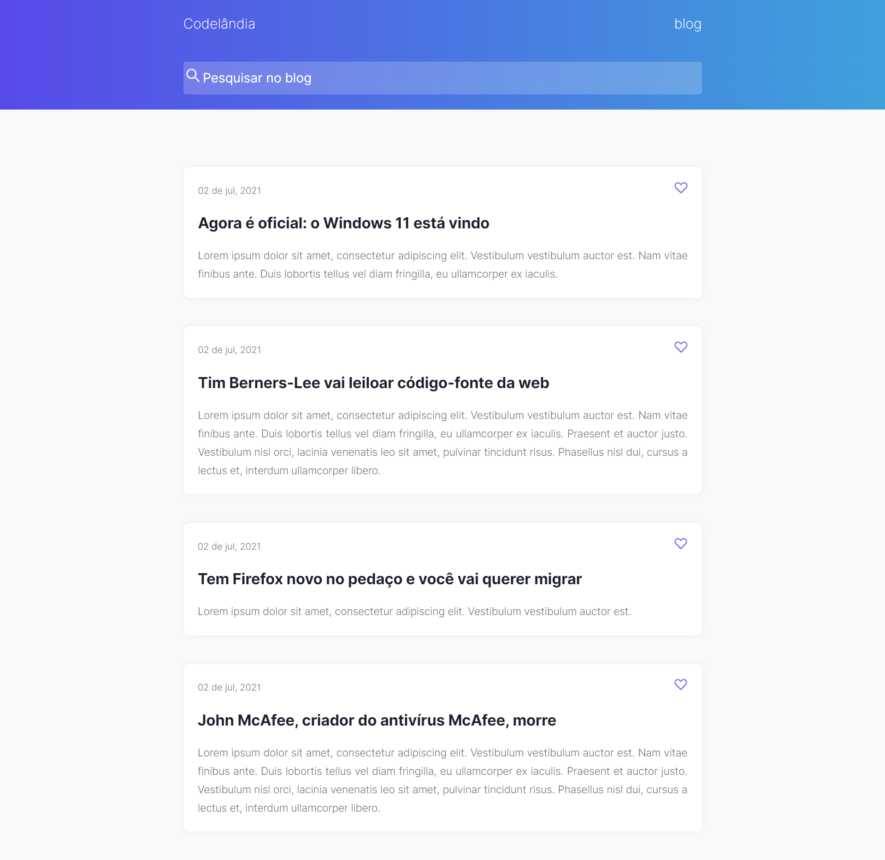

# Codelândia || Blog  || <a href="https://carlosvinicius-ai.github.io/projetos-youtube/CODELANDIA/desafio-01-Blog/">Clique Aqui</a>

## Technologies Used 🧩

*     

> É um blog onde você consegue ver noticias diversas sobre o mundo da tecnologia
  
Feito com **💜** por <a href="https://www.linkedin.com/in/carlosvini/">Carlos Vinícius</a>
